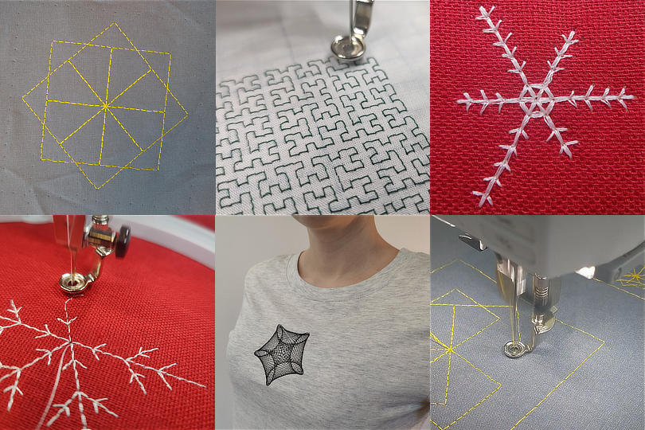

TurtleThread
============

TurtleThread is a tool inspired by `TurtleStitch <https://www.turtlestitch.org/>`_ and powered by `pyembroidery <https://github.com/EmbroidePy/pyembroidery>`_ that lets you program an embroidery machine with a Turtle interface. 

To learn how to use TurtleThread, we recommend looking at the `introduction to TurtleThread <auto_examples/gallery_introduksjon.html>`_, any of the other `example scripts <auto_examples/index.html>`_, or `watch our talk at PyCon US 2023 <https://www.youtube.com/watch?v=OcuhrDIrblo>`_ (the sound can be weird on some devices).

.. toctree::
   :maxdepth: 2
   :caption: Contents:

   installation
   intro/index
   christmas/index
   auto_examples/index
   api/index

Indices and tables
==================
* :ref:`genindex`
* :ref:`modindex`
* :ref:`search`
