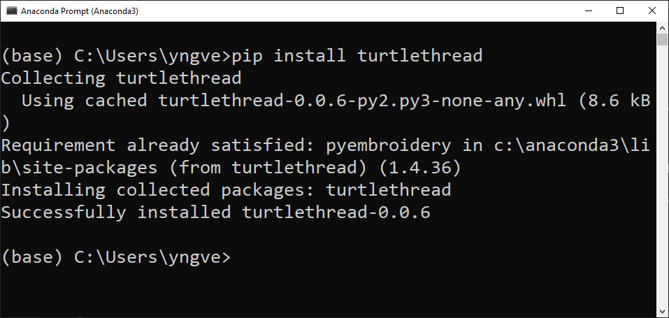

.. highlight:: shell

.. _installasjon:

==================
Installation guide
==================

You can download TurtleThread from the Python package index (PyPI), which makes installation straightforward. 

With Spyder
-----------

The simplest way of installing TurtleThread in Spyder is by running the installation in the terminal, which is located towards the bottom right corner of the program. The image below shows the terminal window highlighted with a red box.

.. image:: ../../_static/figures/installation/spyder_01.png
    :width: 600
    :alt: Screenshot of Spyder showing the location of the terminal.

You can type  ``!pip install turtlethread`` in the terminal and press enter to start the installation. 

.. image:: ../../_static/figures/installation/spyder_02.png
    :width: 600
    :alt: Screenshot of Spyder, which shows how to type in the installation command

.. attention:: 

    If you are using Windows, it will appear like the terminal is frozen while the installation is running. But after a short while (often less than a couple of minutes), TurtleThread should be installed. 
    If this doesn't work, you can try to install TurtleThread from the command prompt instead (see instructions further down)

When the installation is complete, you will get a printout similar to ``Successfully installed pyembroidery-1.4.36 turtlethread-0.0.6`` in the terminal. When we see this message, we next need to ensure that Spyder knows that TurtleThread is installed by restarting the kernel. We can do this by pressing the "Restart kernel" button (or pressing ``ctrl+,``).

.. image:: ../../_static/figures/installation/spyder_03.png
    :width: 600
    :alt: Screenshot of Spyder, which shows how to restart the Python kernel after installing TurtleThread.

With Thonny
-----------

Thonny has a built-in tool to make it easy to install from PyPI. We can find it by pressing "Tools" followed by "Manage packages...". 

Then a window pops up where we can search for TurtleThread (capitalization is ignored). The result looks like this: 

If we press this link, we can install TurtleThread

Press the Install button to start the installation

When the installation is complete, the progress bar will close, and the "Install" button will be replaced with a grey "Update" and "Uninstall" button.

Now you have installed TurtleThread! To ensure that Thonny can use TurtleThread you need to close all Thonny windows and restart Thonny.

With the terminal
-----------------

To install TurtleThread in the terminal, you can write

.. code::

    pip install turtlethread

Exactly what printout you get after running this command can vary from system to system, but the most important part is that it states something like "Successfully installed <...>".
On Windows, it can, for example, look like this:

.. attention::
    
    If you want to install using Anaconda from Windows, you need to go to the start menu and choose  "Anaconda Prompt (Anaconda3)".

For developers
--------------

If you want a version of TurtleThread that is still under development, you can install the latest version of the code from GitHub. 

There are two ways to do this. 
If you only want the latest version, you can download it directly.

.. code::
    
    pip install git+https://github.com/marieroald/turtlethread.git

And suppose you want the latest version and the ability to make changes. In that case, you need to first clone the GitHub repository and then install an editable version with the development dependencies. 

.. code::
    
    git clone https://github.com/marieroald/turtlethread.git
    cd turtlethread
    pip install -e .[dev,docs]

Note that Linux is required to run the tests or build documentation. If you use Windows, we recommend using Ubuntu via Windows Subsystem for Linux. A Dockerfile is included that describes how you should set up the system to run the tests and build the documentation. 