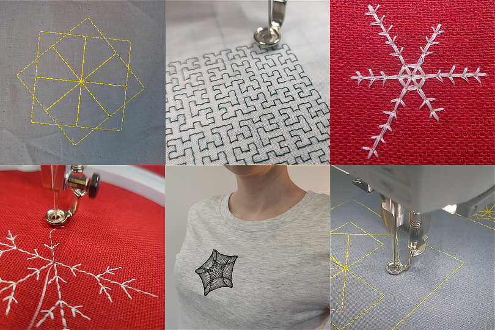

TurtleThread
============

TurtleThread er et verktøy inspirert av `TurtleStitch <https://www.turtlestitch.org/>`_ og som bygger på `pyembroidery <https://github.com/EmbroidePy/pyembroidery>`_ for å la deg programmere en broderimaskin med et Turtle-basert grensesnitt.

.. toctree::
   :maxdepth: 2
   :caption: Contents:

   installation
   intro/index
   christmas/index
   auto_examples/index
   api

Indices and tables
==================
* :ref:`genindex`
* :ref:`modindex`
* :ref:`search`
