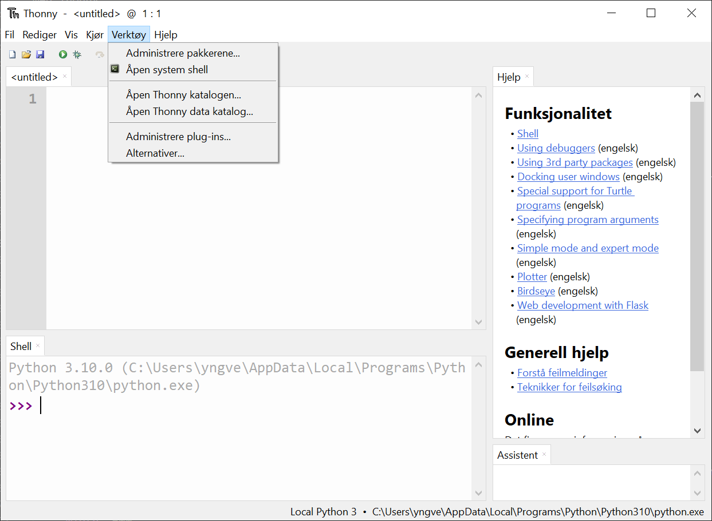
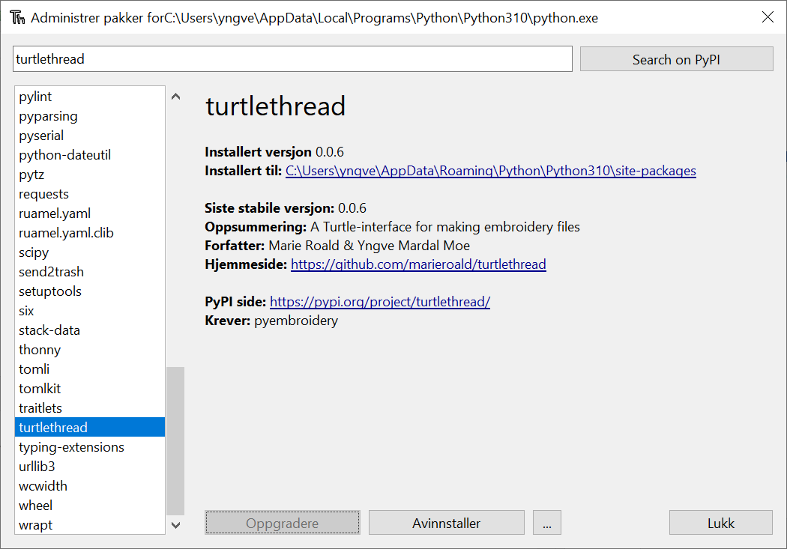

.. highlight:: shell

.. _installasjon:

==================
Installasjonsguide
==================

TurtleThread ligger nedlastbart i Python pakkeindeksen (PyPI), som gjør det veldig lett å installere. 

Med Spyder
----------

Det enkleste er å installere TurtleThread i terminalvinduet som ligger nederst i høyre hjørne av programmet. Nedenfor ser du et bilde hvor terminalvinduet er markert med en rød ramme.

I terminalen kan du skrive ``!pip install turtlethread`` og trykke enter for å starte installasjonen. 

.. image:: ../../_static/figures/installation/spyder_02.png
    :width: 600
    :alt: Skjermdump fra Spyder som viser hvordan vi skriver installasjonskommandoen i Spyder.

.. attention:: 

    På Windows vil det virke som at terminalvinduet har fryst en liten stund mens installasjonen pågår, men etter kort tid (ofte mindre enn et par minutter) skal TurtleThread være installert.
    Dersom dette ikke virker kan du prøve å installere TurtleThread fra terminalen (se instruks lengre nede).

Når installasjonen er ferdig vil det stå noe sånt som ``Successfully installed pyembroidery-1.4.36 turtlethread-0.0.6`` i terminalvinduet.
Når den teksten har kommet opp må vi passe på at Spyder vet at TurtleThread er installert.
For å gjøre dette må vi trykke på "Restart kernel"-knappen (eller trykke ``ctrl+,``).

Med Thonny
----------

Thonny har et innebygd verktøy for å gjøre installasjon fra PyPI lettere.
Denne finner vi ved å trykke på "Verktøy", etterfulgt av "Administrere pakker".

Da får vi et vindu hvor vi kan søke etter TurtleThread (store/små bokstaver spiller ingen rolle). Søkeresultatet ser slik ut

Hvis vi trykker på den lenken får vi muligheten til å installere TurtleThread

.. image:: ../../_static/figures/installation/thonny_03_nb_NO.png
    :width: 600
    :alt: Skjermdump fra Thonny som viser TurtleThread sin informasjonsside før installasjon.

Trykk på "Installere"-knappen for å starte installasjon

Når installasjonen er ferdig vil fremdriftsindikatoren lukkes, og "Installere"-knappen byttes ut med en grå "Oppdatere"- og "Avinstallere"-knapp.

Nå har du installert TurtleThread! For at Thonny skal kunne bruke TurtleThread må du lukke alle Thonny vindu og starte Thonny på nytt.

Med terminalen
--------------

For å installere TurtleThread ved hjelp av terminalvinduet, kan du skrive

.. code::

    pip install turtlethread

Nøyaktig hva som står etter at du har kjørt den kommandoen kan variere litt fra system til system, men det viktigste er at det står "Successfully installed <...>".
På Windows kan det se for eksempel slik ut:

.. image:: ../../_static/figures/installation/terminal_01.png
    :width: 600
    :alt: Skjermdump fra terminalvinduet etter å ha installert TurtleThread.

.. attention::
    
    Dersom du vil gjøre dette med Anaconda fra Windows, må du gå til startmenyen å velge "Anaconda Prompt (Anaconda3)".

For utviklere
-------------

Dersom du ønsker en versjon av TurtleThread som fortsatt er under utvikling, kan du installere siste versjon av koden fra GitHub.
Dette kan du gjøre på to måter.
Hvis du kun vil ha den siste versjonen, kan du laste ned den direkte

.. code::
    
    pip install git+https://github.com/marieroald/turtlethread.git

Og dersom du vil ha siste utgave, og gjøre endringer på den selv, må du først klone kodelageret fra GitHub og så installere en endrebar versjon med utviklingsavhengighetene

.. code::
    
    git clone https://github.com/marieroald/turtlethread.git
    cd turtlethread
    pip install -e .[dev,docs]

Merk at for å kjøre testene eller bygge dokumentasjonen, så kreves Linux.
Fra Windows, anbefaler vi å bruke Ubuntu via Windows Subsystem for Linux.
Det følger med en Dockerfil som beskriver hvordan du bør sette opp systemet for å kjøre testene og bygge dokumentasjonen.
